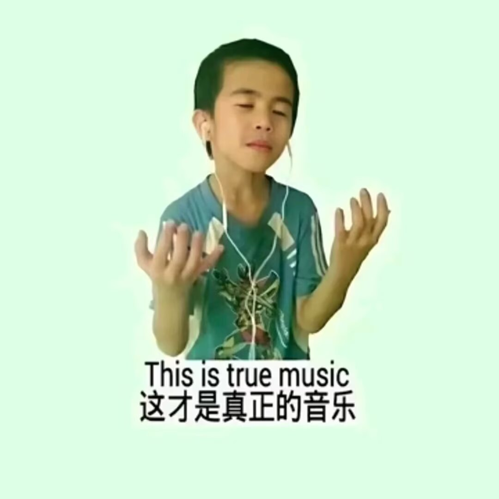

> 2026-03-22 14:13

有人问我为什么这么做，我突然想到了2005年的夏天，那是一个寒冷的立秋，奥特曼问我为什么不站起来吃饭，我说你难道不想想黄鹤的感受吗？如果小姨子统一了战国，李世民还能学得好三角函数吗？那么既然说到了朱元璋，就不得不谈谈为什么我今天能站在比尔盖茨面前说话了。我之所以能打败商纣王，是因为我认识牛顿，没错，正是因为那篇文章鼓舞了我，让我成功得把牛奶发酵成了酸奶。时至今天我拿着手中的卫生纸，想要把指甲剪掉，但是却因为火星逆行而不得不提前躺下睡觉。

---
*from QZone*